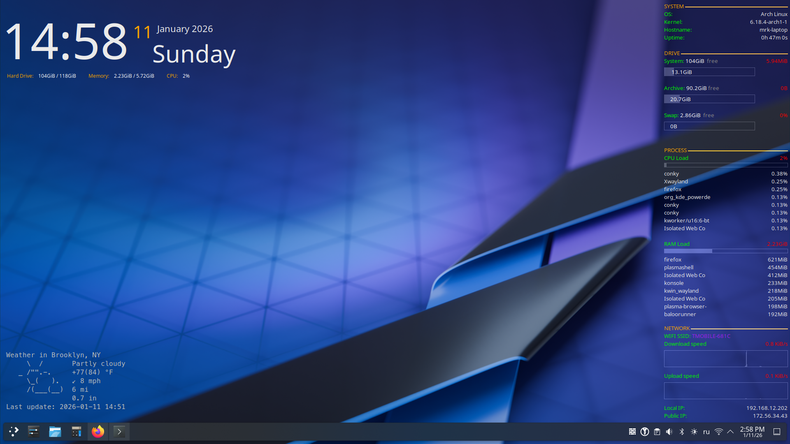

# 🐧 My KDE Conky Theme (EN/RU)

Стильный набор виджетов **Conky** для рабочего стола KDE Plasma. Полностью настроенные конфигурации с поддержкой английского и русского языков, мониторингом системы, погоды и музыкального плеера.



## ✨ Особенности
* **🎨 Дизайн**: Тёмная тема с акцентным оранжевым цветом (`#FFA300`).
* **🕒 Gotham**: Элегантные часы, дата и краткая сводка ресурсов.
* **📈 Process**: Мониторинг ядер CPU, RAM/Swap и дисков (`/` и `/mnt/archive`).
* **🌐 Network**: SSID сети, графики трафика, локальный и внешний IP.
* **☁️ Weather**: Прогноз погоды через сервис `wttr.in`.
* **🎵 Player**: Виджет управления музыкой (работает через `playerctl`).

## 🔡 Необходимые шрифты
Для корректного отображения иконок и текста **обязательно** установите следующие шрифты:

1.  **Noto Sans** (стандартный шрифт KDE).
2.  **MesloLGS NF** (Nerd Font) — необходим для иконок погоды и плеера.
    * [Скачать MesloLGS NF Regular.ttf](https://github.com/romkatv/powerlevel10k-media/raw/master/MesloLGS%20NF%20Regular.ttf)

**Установка шрифтов через терминал:**
```bash
mkdir -p ~/.local/share/fonts
# Скопируйте скачанные файлы .ttf в эту папку
fc-cache -f -v
