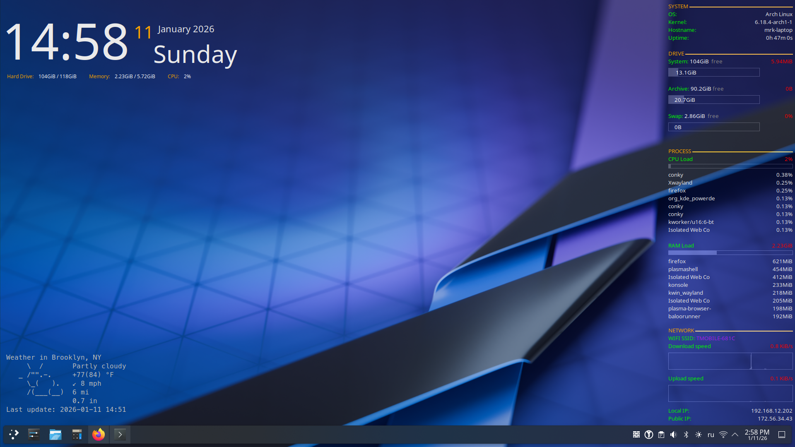

# 🐧 My KDE Conky Theme (EN/RU)

Стильный набор виджетов **Conky** для рабочего стола KDE Plasma. Полностью настроенные конфигурации с поддержкой английского и русского языков, мониторингом системы, погоды и музыкального плеера.



## ✨ Особенности
* **🎨 Дизайн**: Тёмная тема с акцентным оранжевым цветом (`#FFA300`).
* **🕒 Gotham**: Элегантные часы, дата и краткая сводка ресурсов.
* **📈 Process**: Мониторинг ядер CPU, RAM/Swap и дисков (`/` и `/mnt/archive`).
* **🌐 Network**: SSID сети, графики трафика, локальный и внешний IP.
* **☁️ Weather**: Прогноз погоды через сервис `wttr.in`.
* **🎵 Player**: Виджет управления музыкой (работает через `playerctl`).

## 🚀 Быстрый старт

| Команда | Описание |
|---------|----------|
| `./start.sh` | Запуск виджетов Conky |
| `./start.sh -change` | Запуск виджетов **и** установка обоев из `wallpaper.png` |
| `./start.sh stop` | Остановка всех процессов Conky |
| `./start.sh restart` | Перезапуск темы |
| `./start.sh restart -change` | Перезапуск темы **с** установкой обоев |
| `./start.sh boot` | Запуск с задержкой (для автозагрузки KDE) |
| `./start.sh boot -change` | Автозагрузка **с** установкой обоев |

&gt; 💡 **Совет:** Флаг `-change` можно комбинировать с любыми командами (`restart`, `boot`). По умолчанию смена обоев отключена.

## 📦 Установка

1. Скопируйте папку `My_KDE_Eng` или `My_KDE_Rus` в:
   ```bash
   $HOME/.config/conky
